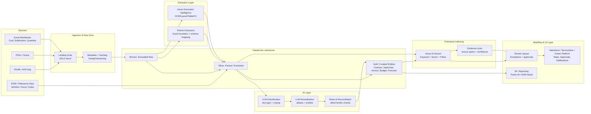
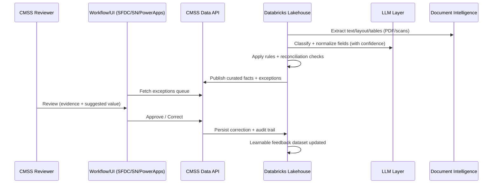
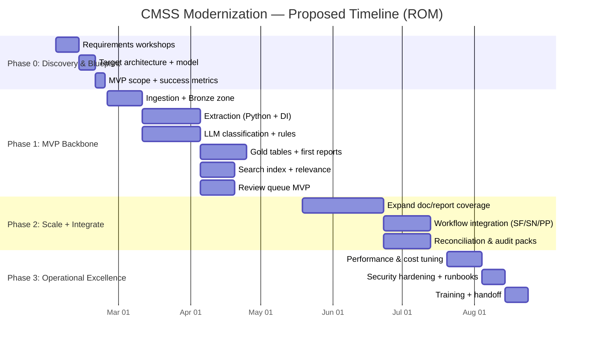
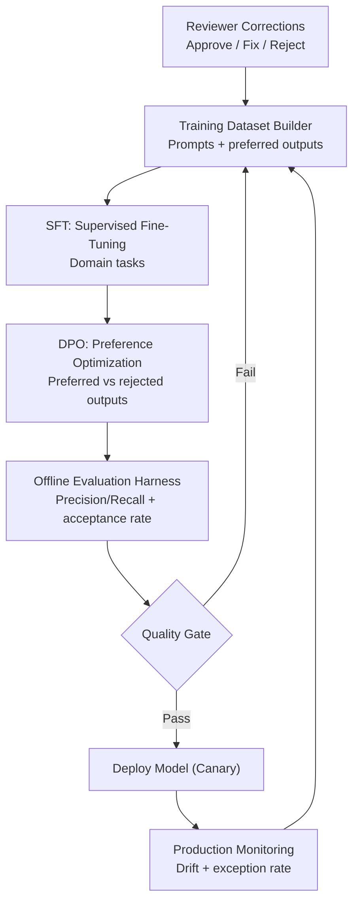

# Client CMSS Modernization Proposal  
**Databricks Lakehouse + Document AI + LLM Classification + Azure AI Search**  
*(Workflow/UIs on Salesforce, ServiceNow, or Microsoft Power Platform)*

**Date:** 2026-01-26  
**Version:** 1.0 (ROM)  

---

## Table of Contents
1. Executive Summary  
2. Current State and Problem Statement  
3. Proposed Future State (Outcome-Driven)  
4. Solution Architecture  
5. Data Pipeline Approach (Databricks + Python + Document Intelligence)  
6. LLM Classification, Normalization, and Review-by-Exception  
7. Azure AI Search Indexing and Discovery Experiences  
8. Workflow Layer (Salesforce / ServiceNow / Power Platform)  
9. Delivery Plan and Timeline  
10. Cost Estimate (ROM)  
11. Stretch Goal: Domain SLM Program (SFT + DPO)  
12. Security, Governance, and Compliance  
13. Risks and Mitigations  
14. Appendices (Assumptions, Sizing, References)

---

## 1. Executive Summary
Client's CMSS workflows currently rely on spreadsheet-centric processes and manual re-keying across contracts, task orders, invoices, and budget execution reporting. This creates predictable failure modes: inconsistent validation, version drift, audit friction, and long cycle times for producing reliable “single version of truth” reports.

We propose a **document-to-data backbone** that treats CMSS artifacts (emails, PDFs, scans, and Excel workbooks) as a governed data product. An **Azure Databricks Lakehouse** pipeline ingests source artifacts; **specialized Python extractors** (supplemented by **Azure Document Intelligence**) convert content into canonical entities; an **LLM classification + normalization layer** reduces re-keying to **review-by-exception**; and **Azure AI Search** provides enterprise indexing (keyword + vector retrieval) to power reporting, audit, and AI-assisted experiences. Azure AI Search supports indexing of JSON documents and AI enrichment patterns that are well-aligned to this solution direction. citeturn0search0turn0search8

With the backbone in place, **Salesforce / ServiceNow / Power Platform** becomes primarily the **workflow and UI layer** (approvals, work queues, tasks, notifications). This flips the current operating model: staff stop re-entering data and instead **validate and approve** what the system has already extracted and reconciled.

---

## 2. Current State and Problem Statement
### Observed patterns (typical of CMSS environments)
- Critical truth lives in Excel workbooks (multiple versions, macros, inconsistent columns, manual rollups).
- Data is frequently re-keyed from documents/spreadsheets into other tracking tools.
- Validation is human-driven, inconsistent, and hard to audit.
- Report generation becomes a monthly/quarterly “ritual” rather than a reliable system capability.

### Core impact
- **High labor cost** spent on low-value data entry and reconciliation.
- **Data quality risk** (keying errors, timing issues, stale snapshots).
- **Audit friction** (weak lineage from reported value → source evidence).

---

## 3. Proposed Future State (Outcome-Driven)
### Target outcomes
- **80–95% reduction** in re-keying effort for “structured-enough” documents and standardized spreadsheets (converted to review task).
- **Review-by-exception**: only low-confidence or rule-violating items require staff attention.
- **Audit-ready lineage**: every field traces back to source artifact + location (page/table/cell).
- **Faster reporting**: curated “Gold” tables drive standardized reports; search and AI retrieval accelerate discovery.

---

## 4. Solution Architecture

---

## 5. Data Pipeline Approach (Databricks + Python + Document Intelligence)

### 5.1 Ingestion (Bronze)
- Capture source artifacts immutably (raw blobs + metadata).
- Version tracking via hash + source timestamps.
- Partitioning by source system, document type, fiscal year.

### 5.2 Extraction (Silver)
**Specialized Python extraction** (critical for “Excel reality”):
- Robustly interprets merged headers, repeated sections, summary/cover tabs, and report-style sheets.
- Converts vendor-provided workbooks into canonical tables (e.g., ContractCostFacts, SubdivisionRollups, InvoiceLineFacts).
- Preserves cell-level provenance for audit and reviewer UX.

**Azure Document Intelligence** (critical for PDFs/scans):
- OCR, layout, and table extraction (and custom models where ROI is strong).
- Document Intelligence pricing is consumption-based (pages analyzed), with published entry pricing starting at **$1.50 per 1,000 pages** for “Read” in the 0–1M pages tier. citeturn2search0  
- Microsoft provides guidance for estimating Document Intelligence costs using processed page metrics and the Azure pricing calculator. citeturn0search13turn2search13

### 5.3 Curation (Gold)
- Canonical “Gold” entities become the reporting backbone:
  - Contract
  - Task Order
  - Invoice / Audit / Payment
  - Budget Allocation / Remaining Authority
  - Forecasts / Projections
- Downstream export to EDW or semantic models.

---

## 6. LLM Classification, Normalization, and Review-by-Exception

### 6.1 LLM tasks (best-fit)
- **Document type classification** (contract, invoice, amendment, rollup report, etc.)
- **Field normalization** (aliases and synonyms → canonical schema)
- **Entity resolution assist** (vendor names, contract identifiers, task order IDs)
- **Evidence highlighting** (what text/table supports the extracted value)

Azure OpenAI pricing (example: GPT-4.1-mini) is published per 1M tokens (input/cached/output), enabling predictable token-based cost modeling. citeturn2search3

### 6.2 Review-by-exception sequence

### 6.3 Key metric
The goal is to convert re-keying into **“approve/correct”**:
- Auto-accept high-confidence items passing deterministic rules
- Queue only exceptions to humans
- Capture every correction as training signal (for the stretch goal)

---

## 7. Azure AI Search Indexing and Discovery Experiences

### 7.1 What gets indexed
- Curated structured records (JSON docs per Contract/Invoice/TaskOrder)
- Extracted text chunks with evidence spans
- Attachments and supporting artifacts with metadata filters (FY, district, subdivision, vendor, status)

Azure AI Search supports self-managed search units and scaling via replicas/partitions; Microsoft documents capacity planning and tier limits. citeturn0search8

### 7.2 Search-enabled experiences
- “Find every invoice where remaining authority went negative”
- “Show all task orders tied to vendor X in FY26 with overrun risk”
- “Explain why contract Y’s reported remaining authority differs between reports”

---

## 8. Workflow Layer (Salesforce / ServiceNow / Power Platform)
Once the backbone exists, the workflow platform choice is primarily about:
- Task management and approvals
- Role-based routing
- Notifications and SLA tracking
- Forms for exception resolution

The key point: **the platform consumes validated, canonical data** instead of requiring users to re-enter it.

---

## 9. Delivery Plan and Timeline

### 9.1 Phased approach
- **Phase 0 — Discovery & Blueprint (3 weeks)**  
  Canonical data model, prioritized document types/reports, security/governance plan.
- **Phase 1 — MVP Backbone (10 weeks)**  
  Ingestion + Bronze/Silver/Gold for initial scope; review queue; first search index.
- **Phase 2 — Scale + Integrate (12 weeks)**  
  Expand coverage to remaining reports/workflows; connect workflow platform; stronger reconciliation.
- **Phase 3 — Operational Excellence (6 weeks)**  
  Monitoring, lineage packs, performance tuning, handoff, and production hardening.

### 9.2 Timeline (Gantt)

---

## 10. Cost Estimate (ROM)

> **Important:** This is a **rough-order-of-magnitude estimate** based on typical state modernization programs and the artifacts provided (Excel-driven cost tracking + standardized reporting inventory). Final pricing requires confirming volumes, environments, security constraints, and workflow platform scope.

### 10.1 One-time implementation services (ROM)
| Workstream | Low | Expected | High |
|---|---:|---:|---:|
| Phase 0 (Discovery & Blueprint) | $150k | $200k | $275k |
| Phase 1 (MVP Backbone) | $450k | $650k | $850k |
| Phase 2 (Scale + Integrate) | $550k | $800k | $1.1M |
| Phase 3 (Operational Excellence) | $250k | $350k | $500k |
| **Total** | **$1.4M** | **$2.0M** | **$2.7M** |

**Notes**
- Includes Databricks pipelines, extraction logic, LLM layer, search indexing, and an MVP review queue.
- **Workflow platform implementation** (Salesforce/ServiceNow/Power Platform) may be “thin” (integrations + queues) or “thick” (full CMSS UI). The table assumes **thin-to-moderate** scope.

### 10.2 Ongoing cloud operating costs (per month, ROM)
We present three scenarios based on document throughput (contracts/invoices/supporting artifacts).  
**Assumption:** 8 pages per “document package” on average.

| Scenario | Volume (docs/mo) | Doc Intelligence (Read)* | LLM classify/normalize** | Azure AI Search (S1 units)*** | Databricks + Storage + Ops**** | **Total / mo (ROM)** |
|---|---:|---:|---:|---:|---:|---:|
| Pilot | 5,000 | $60–$400 | $10–$75 | $500–$1,000 | $8k–$20k | **$9k–$21k** |
| Steady-state | 50,000 | $600–$4,000 | $75–$500 | $1k–$3k | $20k–$55k | **$22k–$62k** |
| Peak | 250,000 | $3,000–$20,000 | $350–$2,500 | $2k–$8k | $45k–$120k | **$50k–$150k** |

\* Document Intelligence “Read” entry pricing is published at **$1.50 per 1,000 pages** (0–1M pages), but prebuilt/custom models may price differently; we show a range to reflect model mix. citeturn2search0turn2search4  
\** Token pricing varies by model and deployment; Azure OpenAI lists per-1M token pricing (example: GPT-4.1-mini). citeturn2search3turn2search7  
\*** Azure AI Search tier/unit pricing is region-specific; public sources commonly cite S1 around **$0.336/hour per unit** (≈$245/month per unit at 730 hours). citeturn2search5  
\**** Databricks cost depends on DBU consumption by cluster type/size and infrastructure; Azure Databricks pricing explains DBU-based metering (per-second usage) and that DBU consumption depends on instance type. citeturn2search2turn2search10

### 10.3 Workflow platform licensing (excluded)
Salesforce / ServiceNow / Power Platform licensing and any existing enterprise agreements are not included. We recommend selecting the workflow platform based on Client's enterprise standards—**after** the document-to-data backbone proves value.

---

## 11. Stretch Goal: Domain SLM Program (SFT + DPO)

### 11.1 Why do this?
After MVP, corrections captured in the review queue become high-value training data. A domain-optimized SLM can:
- reduce exception rates (fewer items needing review),
- improve normalization and reconciliation suggestions,
- provide consistent “CMSS-native” reasoning and explanations.

### 11.2 Training loop (SFT + DPO)

### 11.3 Stretch deliverables
- Labeling + preference-data specification
- Evaluation harness (accuracy, reviewer acceptance rate, exception-rate trend)
- Initial SFT + DPO run and gated deployment
- Safety controls and rollback playbooks

### 11.4 Stretch cost (ROM)
| Item | Low | Expected | High |
|---|---:|---:|---:|
| Data engineering + labeling workflow | $100k | $175k | $250k |
| SFT + DPO experimentation + evaluation harness | $150k | $275k | $450k |
| MLOps deployment + monitoring | $75k | $150k | $250k |
| **Total (stretch)** | **$325k** | **$600k** | **$950k** |

If using fine-tunable hosted models, fine-tuning pricing is commonly token-based (training + input/output) and published by providers; for example, OpenAI lists fine-tuning training rates per 1M tokens for GPT-4.1 family. citeturn2search11  
(Exact approach and cost will depend on whether Client prefers fully managed fine-tuning, open-source SLMs, or Azure ML-managed training.)

---

## 12. Security, Governance, and Compliance
- Data access is role-based, least-privilege, and auditable end-to-end.
- Maintain source immutability (Bronze), deterministic transformations (Silver/Gold), and evidence links.
- Search indexes inherit security trimming via metadata filters and access control integrations.

---

## 13. Risks and Mitigations
| Risk | Mitigation |
|---|---|
| Excel variability (macro workbooks, drift) | Python extraction library with pattern catalog + golden test sets; treat templates as versioned artifacts. |
| Model hallucination / low-confidence automation | Strict gating: deterministic rules + confidence thresholds; human-in-the-loop for exceptions only. |
| Cross-system identifier mismatches | Reference-data mastering (EDW/registries) + entity resolution layer. |
| Adoption resistance | Start with MVP on highest pain workflows; show measurable “hours saved” via exception-rate and cycle-time KPIs. |

---

## 14. Appendices

### A. Key assumptions used for ROM
- 8 pages per average “document package” (contract/invoice/supporting pages).
- Pilot/Steady/Peak volumes chosen to bracket likely reality.
- Dev/Test/Prod environments required for enterprise deployment.
- Workflow platform scope assumed “thin-to-moderate” (queues + approvals + integrations).

### B. Cost modeling notes (how to refine)
- Use **actual processed page counts** (Document Intelligence metrics) to pin DI cost. citeturn0search13  
- Use **token telemetry** for LLM calls to refine ongoing cost. citeturn2search3turn2search7  
- Use **search unit sizing** (replicas/partitions) based on query load and index size. citeturn0search8turn2search5  
- Use the Azure pricing calculator for region-specific totals. citeturn2search13

### C. Pricing reference sources used (for modeling only)
- Document Intelligence entry pricing: **$1.50 / 1,000 pages** for Read (0–1M tier). citeturn2search0  
- Azure OpenAI token pricing examples for GPT-4.1-mini. citeturn2search3  
- Azure AI Search S1 hourly price often cited publicly (verify region). citeturn2search5  
- Databricks DBU-based metering and examples (verify region/workload mix). citeturn2search2turn2search10  

---

**End of proposal**
