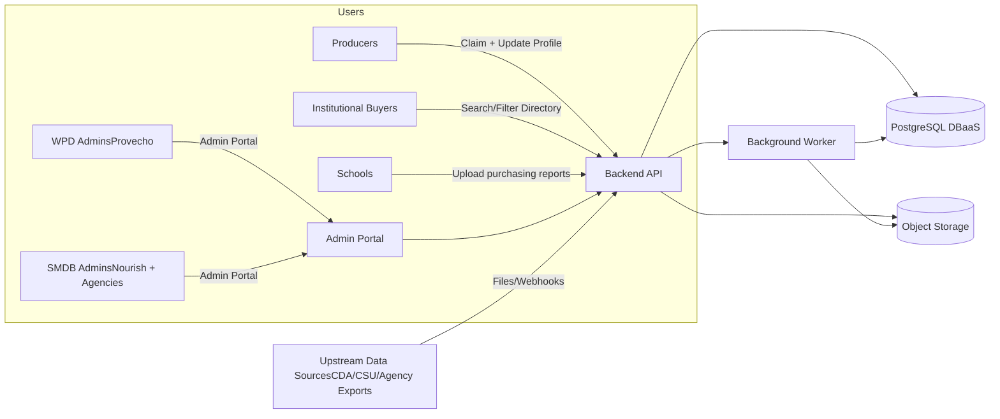
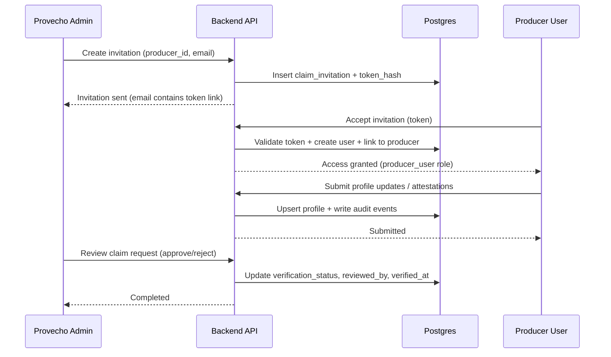
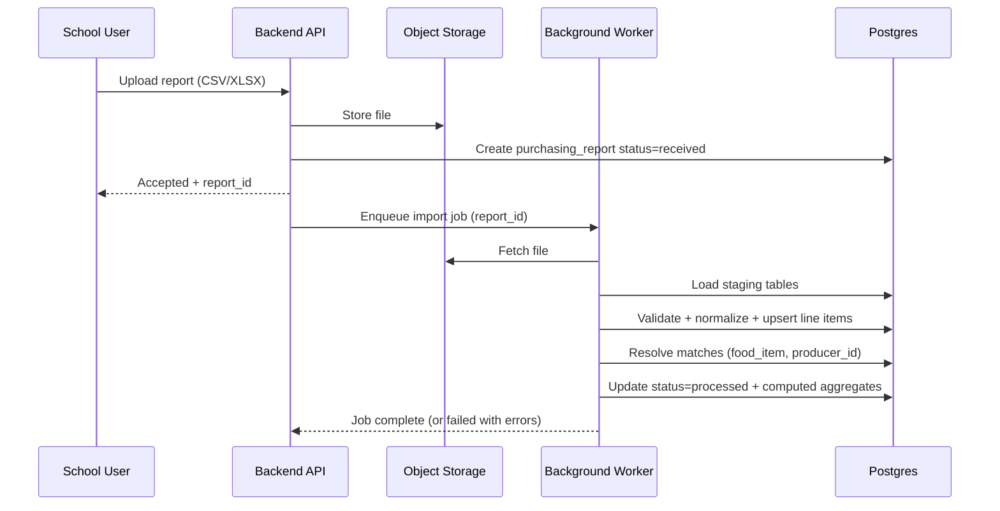

# Software Design Document (SDD)
## Client Food Systems Databases
### (1) Client Wholesale Producer Directory (WPD) + (2) Database to Improve School Meals (SMDB)
**Version:** 1.0  
**Date:** 2026-01-30  
**Audience:** Provecho Collective + Nourish Client stakeholders, implementation partner, and internal administrators.

---

## 1. Executive summary

This SDD defines a modular backend platform consisting of two relational, cloud-hosted PostgreSQL databases and a shared integration layer:

1. **Wholesale Producer Directory (WPD)**: a centralized directory of Client wholesale producers (farmers/ranchers) intended to serve institutional buyers, align with public grant eligibility, and support verification workflows.
2. **School Meals Database (SMDB)**: a proof-of-concept database that tracks, classifies, and analyzes school-meal ingredients and purchasing data to enable reporting and support a better “meal crediting” model.

A **Shared Integration Layer** provides:
- Common identity & access patterns (roles, permissions, audit logging)
- Canonical APIs and data crosswalks to connect WPD and SMDB in both directions
- A consistent approach to imports (manual upload, bulk import, webhooks/API ingestion)
- Simple, user-friendly reporting via views/materialized views and an admin/reporting UI

This document is written to support an implementation partner delivering:
- PostgreSQL schemas, functions/procedures/triggers, and migrations
- An API layer (REST, OpenAPI documented) for the directory/search, claim workflow, imports, and reporting
- A lightweight database management tool (admin portal) and reporting interface
- Operations runbook components (backups, monitoring, onboarding)

---

## 2. Requirements traceability (RFP-derived)

### 2.1 WPD (Wholesale Producer Directory) core requirements
- Cloud-hosted **PostgreSQL SaaS** database.
- Core entities: producer contacts/attributes/certifications; product lists; service areas/geographic coverage; verification status; last-updated metadata.
- **Database-level RBAC** and **audit logs**.
- Database management tool:
  - Maintainable by internal team
  - Uses stored functions/procedures/triggers
  - Manual and automated (webhook/API) data import
  - Simple reports
  - Read access for SMDB (Nourish Client) database
- Website codebase / front-end integration:
  - **Claim profile workflow** (invitation → verification → approval)
  - Granular access levels
  - Manual user data import
  - Directory interaction (search/browse/filter)

### 2.2 SMDB (Database to Improve School Meals) core requirements
- Cloud-hosted relational database + management interface.
- Sort ingredients into **customizable categories** (fresh/whole → ultra-processed).
- Calculate/analyze nutrition values and summaries by category.
- Generate simple, user-friendly compliance reports.
- Manual entry and bulk upload/import of purchasing reports.
- Login portals for multiple stakeholder types (schools, agencies, etc.).
- Track trends over time (inventory/purchasing).
- Architecture should be scalable/dynamic (potential federal/nationwide adoption).
- Post-POC, API connectivity to wholesale producer databases is valuable.
- Prioritize ingredients purchased from **Client producers with specific attributes**.

---

## 3. Scope, non-scope, and assumptions

### 3.1 In scope (POC-ready architecture)
- PostgreSQL logical data model for WPD + SMDB + shared integration schema
- A backend API layer (REST) for:
  - CRUD on admin-managed entities
  - Claim-profile workflow endpoints
  - Imports (files + webhook/API)
  - Reporting endpoints
  - Read-only cross-database access
- A lightweight **Admin Portal / Database Management Tool** for:
  - Reviewing and editing producers, products, coverage, certifications, verification
  - Uploading/importing datasets and reviewing import errors
  - Creating reports and exporting CSV/PDF
  - Managing user access and roles
- Security model: identity, RBAC, audit trails, and data privacy controls
- DevOps: schema migrations, backups, monitoring/logging, deployment patterns
- Documentation outputs: ERD, API docs, security model, runbook

### 3.2 Out of scope (explicitly)
- Full public website build (frontend UX, content pages, hosting), beyond the backend integration layer and API.
- Detailed USDA crediting formula implementation (the platform will support configurable rules and reporting; domain formulae can be layered in).

### 3.3 Key assumptions
- Provecho/Nourish will provide initial datasets, field definitions, and any upstream agency data exports.
- Authentication will use a standards-based provider (OIDC) to avoid custom password storage.
- “Proof of concept” prioritizes correctness, maintainability, and workflow completeness over pixel-perfect UI.

---

## 4. High-level architecture

### 4.1 Logical components

- **PostgreSQL Cluster (DBaaS)**
  - `wpd` schema: producer directory domain
  - `smdb` schema: school meals domain
  - `shared` schema: cross-domain canonical entities + crosswalk tables
  - `audit` schema: immutable audit log + event ledger
- **Backend API service**
  - REST APIs with OpenAPI spec
  - Authentication (OIDC JWT verification)
  - Authorization enforcement (role + row-level rules)
  - Import processing + background jobs
- **Admin Portal (Database Management Tool)**
  - Admin workflows, verification queue, import console, user management, reports
- **Reporting layer**
  - Database views/materialized views for “simple, user-friendly reports”
  - Optional embedded BI (open-source) if desired (e.g., Metabase/Superset) behind auth
- **Object storage**
  - Stores import files (CSV/XLSX/JSON) and report exports
- **Background worker**
  - Executes import jobs, scheduled refresh of materialized views, and (optional) sync tasks

### 4.2 System context diagram (Mermaid)

---

## 5. Data architecture

### 5.1 Multi-schema strategy (recommended)

Use **one PostgreSQL cluster** (single DBaaS subscription) with multiple schemas and strict permissions. This reduces cost and simplifies cross-database reads required by both RFPs, while still preserving domain separation.

- `wpd.*` : WPD domain tables
- `smdb.*` : SMDB domain tables
- `shared.*`: canonical cross-domain tables
- `audit.*` : append-only audit/event tables

> Alternate deployment (supported): two separate DBs with the same schema layout; integration is via API + sync jobs. The API layer remains unchanged; only the connection strings and integration jobs vary.

### 5.2 Canonical keys and identifiers
- Use **surrogate primary keys** (`bigint` / `uuid`) for internal relations.
- Use stable business identifiers for crosswalk where available:
  - Producer: EIN (if provided), USDA/agency IDs, or internal `producer_external_id`
  - Food items: USDA FoodData Central ID or other reference IDs (if available)
- All externally-ingested records retain `source_system`, `source_record_id`, and `raw_payload` references for traceability.

### 5.3 Data domains and key entities

#### 5.3.1 WPD domain (`wpd`)
- Producer, ProducerLocation, ProducerContact
- ProducerAttributes (BIPOC-owned, fair wages, regenerative, etc.)
- Certifications (Organic, GAP, etc.)
- Products + ProductAttributes
- ServiceArea (county/region list + optional geospatial)
- VerificationStatus + verification events
- ClaimProfile: invitations, claims, approvals

#### 5.3.2 SMDB domain (`smdb`)
- Organization (school district, agency)
- Ingredient/FoodItem
- Category + CategoryAssignment (customizable taxonomy)
- NutritionFact (per item, per 100g or per serving)
- PurchasingReport (uploaded file) + PurchasingLineItem
- TrendSnapshots (aggregates per org/time period)
- ComplianceReport runs and outputs (optional persistence)

#### 5.3.3 Shared integration (`shared`)
- Canonical Producer (shared view/copy for linking)
- Canonical Product (shared view/copy for linking)
- Attribute taxonomy (shared lookup)
- Crosswalk tables:
  - `shared.producer_xref` (WPD producer ↔ external IDs)
  - `shared.item_vendor_xref` (purchasing vendor ↔ producer)
  - `shared.product_xref` (SMDB ingredients ↔ WPD products, when determinable)
- Common geo tables (counties/regions)

#### 5.3.4 Audit (`audit`)
- `audit.event_ledger` (append-only): “who did what, when, from where”
- `audit.row_change_log` (optional): captures before/after snapshots for key tables
- `audit.import_job` + `audit.import_job_item` for import traceability

---

## 6. Detailed schema (conceptual)

> This is a **conceptual design**. The implementation should also generate an ERD and a full data dictionary as a deliverable.

### 6.1 WPD tables (conceptual)

**`wpd.producer`**
- `producer_id (uuid pk)`
- `legal_name`
- `display_name`
- `business_type` (farm, ranch, aggregator, co-op)
- `website_url`
- `is_active`
- `verification_status` (enum: unverified/pending/verified/suspended)
- `verified_at`, `verified_by_user_id`
- `last_profile_update_at`
- `created_at`, `created_by_user_id`, `updated_at`, `updated_by_user_id`

**`wpd.producer_contact`**
- `contact_id (uuid pk)`
- `producer_id (fk)`
- `contact_name`
- `email`, `phone`
- `preferred_contact_method`
- `is_public` (controls public visibility)

**`wpd.producer_attribute`**
- `producer_id (fk)`
- `attribute_code` (fk to `shared.attribute_taxonomy`)
- `evidence_url` (optional)
- `attested_by` (producer/admin)
- `attested_at`

**`wpd.producer_certification`**
- `producer_id (fk)`
- `certification_code` (fk)
- `issuer`
- `valid_from`, `valid_to`
- `document_url` (optional)

**`wpd.product`**
- `product_id (uuid pk)`
- `producer_id (fk)`
- `product_name`
- `product_category` (produce/dairy/meat/etc.)
- `pack_size`, `unit_of_measure`
- `seasonality_start`, `seasonality_end`
- `is_available`

**`wpd.service_area`**
- `service_area_id (uuid pk)`
- `producer_id (fk)`
- `coverage_type` (county/region/statewide/custom)
- `coverage_codes` (array of county/region codes)
- `geom` (optional geography polygon)
- `notes`

**`wpd.claim_invitation`**
- `invitation_id (uuid pk)`
- `producer_id (fk)`
- `invite_email`
- `invite_token_hash`
- `expires_at`
- `status` (sent/accepted/expired/revoked)
- `created_by_user_id`, `created_at`

**`wpd.claim_request`**
- `claim_request_id (uuid pk)`
- `producer_id (fk)`
- `requesting_user_id`
- `submitted_at`
- `status` (pending/approved/rejected)
- `reviewed_by_user_id`, `reviewed_at`
- `review_notes`

### 6.2 SMDB tables (conceptual)

**`smdb.organization`**
- `org_id (uuid pk)`
- `org_type` (school_district/agency/other)
- `org_name`
- `county_code`
- `created_at`

**`smdb.food_item`**
- `food_item_id (uuid pk)`
- `item_name`
- `brand_name` (optional)
- `external_ref_type` (usda_fdc, custom, none)
- `external_ref_id` (string)
- `default_uom`
- `is_active`

**`smdb.category`**
- `category_id (uuid pk)`
- `category_name`
- `category_tier` (e.g., fresh/whole, minimally_processed, processed, ultra_processed)
- `is_custom` (bool)
- `org_id` (nullable; supports org-specific taxonomies)

**`smdb.category_assignment`**
- `food_item_id (fk)`
- `category_id (fk)`
- `assigned_by_user_id`
- `assigned_at`
- `assignment_method` (rule/manual/import)

**`smdb.nutrition_fact`**
- `food_item_id (fk)`
- `basis` (per_100g/per_serving)
- `calories_kcal`, `protein_g`, `fat_g`, `carb_g`
- `sodium_mg`, `saturated_fat_g`, `fiber_g`, `sugars_g`
- `source` (usda/vendor/manual)
- `source_confidence` (0–1)
- `updated_at`

**`smdb.purchasing_report`**
- `report_id (uuid pk)`
- `org_id (fk)`
- `report_period_start`, `report_period_end`
- `uploaded_by_user_id`
- `upload_object_key`
- `status` (received/processing/processed/failed)
- `processed_at`

**`smdb.purchasing_line_item`**
- `line_item_id (uuid pk)`
- `report_id (fk)`
- `vendor_name`
- `vendor_item_code`
- `description`
- `quantity`, `uom`
- `unit_price`, `extended_price`
- `purchase_date`
- `food_item_id` (nullable; resolved by matching)
- `producer_id` (nullable; resolved via integration)
- `match_confidence`

**`smdb.trend_snapshot`**
- `org_id`
- `period` (month/quarter)
- `total_spend`
- `spend_by_category` (jsonb)
- `pct_fresh_whole`
- `pct_ultra_processed`
- `calculated_at`

---

## 7. Identity, authorization, and security

### 7.1 Authentication (AuthN)
- Use an OIDC-compliant identity provider:
  - Low cost option: **Supabase Auth** (if using Supabase Postgres) or a managed OIDC provider
  - Alternative: Azure AD B2C / Auth0 / Cognito
- API validates JWTs (issuer, audience, signature).
- Admin Portal uses the same provider.

### 7.2 Authorization (AuthZ) model
Use a layered approach:

1. **Role-based access control (RBAC)** at the application layer:
   - roles: `system_admin`, `wpd_admin`, `smdb_admin`, `org_admin`, `producer_user`, `buyer_user`, `agency_user`, `readonly`
2. **Database-level permissions**:
   - separate DB roles for services (`api_service_role`, `admin_portal_role`, `reporting_role`)
   - least privilege grants by schema/table
3. **Row-level security (RLS)** for multi-tenant data in SMDB:
   - users can access only their organization’s purchasing data unless admin
4. **Audit logs**:
   - log all administrative writes and sensitive reads

### 7.3 Audit logging
**Design goals**
- Provide tamper-resistant, append-only logging of key actions.
- Correlate API request → user → affected entities.

**Implementation**
- `audit.event_ledger` table with:
  - `event_id`, `timestamp`, `actor_user_id`, `actor_role`, `ip`, `user_agent`
  - `action` (e.g., WPD_PRODUCER_UPDATE, SMDB_REPORT_IMPORT)
  - `entity_type`, `entity_id`
  - `before`, `after` (jsonb optional)
  - `correlation_id` (propagated from API request)
- Triggers on critical tables (`wpd.producer`, `smdb.purchasing_line_item`, etc.) insert audit events.

### 7.4 Data privacy and public visibility
- For WPD, explicitly mark contact fields as public/private (`is_public`, field-level visibility flags).
- Ensure that sensitive fields are not exposed by public endpoints.

---

## 8. Workflows

### 8.1 WPD “Claim Profile” workflow (invitation → verification → approval)

### 8.2 SMDB purchasing report import workflow

---

## 9. Integration layer (WPD ↔ SMDB)

### 9.1 Integration goals
- Allow SMDB reports to reference Client producers and their attributes for prioritization.
- Allow WPD tools to access SMDB read-only data when needed.
- Support future expansion: multi-state data, additional producer sources, national scale.

### 9.2 Recommended integration pattern (POC)
**Canonical API + shared crosswalk tables**:
- Maintain a canonical producer identity in `shared.producer_xref`.
- Match purchasing vendors and items to producers via `shared.item_vendor_xref`.
- Expose read-only endpoints for:
  - `GET /integration/producers?attribute=organic`
  - `GET /integration/producer/{producer_id}`
  - `GET /integration/smdb/org/{org_id}/trend?period=monthly`

### 9.3 Matching strategy (iterative)
Use a confidence-scored matching pipeline:
1. Exact matches: known vendor IDs, known producer external IDs
2. Fuzzy name matching (normalized vendor_name ↔ producer display/legal name)
3. Manual overrides in admin portal (persisted in crosswalk tables)

---

## 10. API design (REST, OpenAPI)

### 10.1 API principles
- Versioned routes: `/api/v1/...`
- OpenAPI/Swagger published internally; external subset exposed if needed
- Strict input validation; idempotent imports where possible
- Correlation IDs required for audit traceability

### 10.2 Key endpoints (illustrative)

#### WPD
- `GET /api/v1/wpd/producers` (filter by county, product, certification, attributes, verified)
- `GET /api/v1/wpd/producers/{producer_id}`
- `POST /api/v1/wpd/producers` (admin)
- `PATCH /api/v1/wpd/producers/{producer_id}` (admin or claimed producer with constraints)
- `POST /api/v1/wpd/claim/invitations` (admin)
- `POST /api/v1/wpd/claim/accept` (producer)
- `POST /api/v1/wpd/claim/submit` (producer)
- `POST /api/v1/wpd/claim/review` (admin)

#### SMDB
- `GET /api/v1/smdb/food-items`
- `POST /api/v1/smdb/food-items` (admin)
- `POST /api/v1/smdb/purchasing-reports/upload`
- `GET /api/v1/smdb/purchasing-reports/{report_id}`
- `GET /api/v1/smdb/reports/compliance?org_id=&period=`
- `GET /api/v1/smdb/reports/trends?org_id=&period=monthly`

#### Integration
- `GET /api/v1/integration/producers` (subset of producer fields)
- `GET /api/v1/integration/producers/{producer_id}`
- `GET /api/v1/integration/smdb/trends?org_id=...`

---

## 11. Importing and data governance

### 11.1 Supported import types
- CSV/XLSX uploads via Admin Portal and authenticated user portals
- JSON API ingestion (bulk upsert)
- Webhooks (signed requests) for external partners

### 11.2 Staging model
- Every import loads into `*_staging` tables first.
- Validation rules:
  - required fields present
  - value normalization (units, county codes)
  - dedupe (producer identity, food item identity)
- Only after validation do records upsert into canonical tables.
- Errors stored in `audit.import_job_item` and visible in admin UI.

### 11.3 Stored procedures and triggers
To support maintainability and internal ease-of-use:
- `wpd.fn_upsert_producer_profile(jsonb payload)`
- `wpd.fn_set_verification_status(producer_id, status, notes)`
- `smdb.fn_import_purchasing_report(report_id)`
- `audit.trg_write_event_ledger()` triggers on key tables

---

## 12. Reporting

### 12.1 “Simple, user-friendly” reports
Implement reports as:
- Parameterized SQL views or database functions returning tabular results
- Materialized views for expensive aggregates (refresh nightly or on-demand)
- Export formats:
  - CSV (first)
  - PDF (optional, generated from HTML templates)

### 12.2 Report examples
- WPD:
  - Verified producers by county and product category
  - Producers pending verification and “last updated” ages
- SMDB:
  - Spend and percent-by-category (fresh → ultra-processed) per org per period
  - Nutrition summary by category for a time window
  - “Client producer attribute” spend summary (organic/regenerative/etc.)

---

## 13. Non-functional requirements

### 13.1 Scalability
- Postgres partitioning strategy (for `smdb.purchasing_line_item` by time/org)
- Background workers for import jobs and heavy calculations
- Read replicas optional for national scale

### 13.2 Availability and backups
- DBaaS automated backups (daily) + point-in-time recovery (PITR) if available
- Export critical configuration and schemas in migrations
- Object storage lifecycle policies for uploaded files and exports

### 13.3 Observability
- Structured logging with correlation IDs
- Metrics: import duration, import failure rates, API latency, DB query timings
- Alerts on: repeated import failures, auth failures, DB disk usage

### 13.4 Security hardening
- TLS everywhere; strict CORS on APIs
- Principle of least privilege for DB roles
- Webhook signatures (HMAC) for inbound events
- Regular dependency scanning for API service

---

## 14. Deployment and DevOps

### 14.1 Environments
- `dev` → `staging` → `prod`
- Separate DB schemas per environment or separate clusters (preferred)

### 14.2 CI/CD
- Automated tests + lint + build
- Database migrations (Flyway/Liquibase) applied in pipeline
- Blue/green deploy for API service if supported by host

### 14.3 Data migration and seed
- Seed lookup tables (counties, attribute taxonomy, category tiers)
- Initial bulk import scripts for initial datasets

---

## 15. Testing strategy

- Unit tests:
  - validation rules, parsers, matching logic
- Integration tests:
  - API endpoints with a test Postgres container
- Data quality tests:
  - import idempotency checks
  - referential integrity checks
- Security tests:
  - RBAC/RLS enforcement tests (attempt unauthorized reads/writes)

---

## 16. Key risks and mitigations

1. **Ambiguous identities and messy upstream data**  
   *Mitigation*: staging/validation pipeline, raw payload retention, crosswalk tables, admin overrides.

2. **Public data + privacy constraints**  
   *Mitigation*: field-level visibility flags, separate “public profile” views, audits for sensitive reads.

3. **Complexity of meal crediting rules**  
   *Mitigation*: rule-engine-friendly category model + configurable reporting; defer USDA-specific formulas to Phase 2.

4. **Budget/time constraints**  
   *Mitigation*: prioritize workflow completeness, import/reporting, and core RBAC; defer advanced BI and geospatial polygons.

---

## 17. Open questions (to resolve in discovery)

- Exact list of upstream datasets and their formats (CSV exports? API? webhooks?)
- Required geographic granularity: counties only, or polygons/zip codes?
- Public directory search requirements: full-text, faceted filtering, geospatial radius?
- Definition of “compliance report” outputs for SMDB (fields, formats, required metrics)
- Identity provider constraints (preferred vendor, domain policies, etc.)
- Data retention policies for uploaded purchasing reports (how long to store raw files?)

---

## Appendix A: Suggested minimal tech stack (non-binding)

- **DBaaS**: Managed Postgres (vendor-agnostic)
- **API**: FastAPI (Python) or NestJS (Node) + OpenAPI
- **Admin Portal**: React + a low-code admin framework (e.g., Appsmith/Directus) *or* a custom lightweight admin UI
- **Reporting**: SQL views + optional Metabase
- **Jobs**: Background worker (Celery/RQ/Sidekiq/BullMQ)
- **Migrations**: Flyway/Liquibase
- **Storage**: S3-compatible object storage (vendor-neutral)

---
